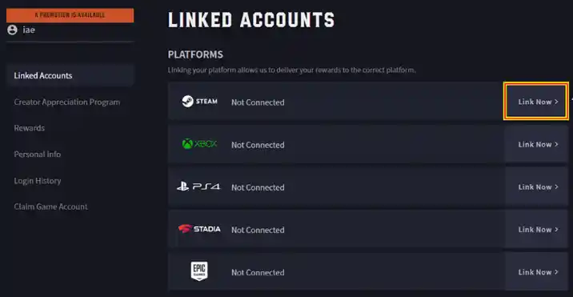
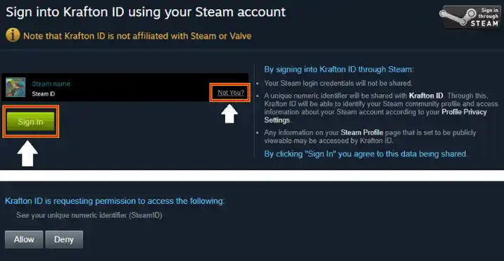

# Managing Your KRAFTON ID for inZOI

## Linking KRAFTON ID with Steam

To play inZOI, you'll need to connect your Steam account to your KRAFTON ID. Follow these steps:

1. Visit [KRAFTON Account Portal](https://accounts.krafton.com/login)
2. Sign in to your KRAFTON account
3. Navigate to the "Linked Accounts" section
4. Locate "Steam" at the top of the list
5. Click "Link Now"

6. On the Steam authentication page:
   - Verify that the correct Steam account is shown
   - Click "Sign in" to proceed
   - If needed, click "Not you?" to switch accounts

7. Click "Allow" to authorize the connection

After successful linking, you'll be redirected to the KRAFTON ID page with a confirmation message. You can now launch inZOI through your Steam account.

## Unlinking Your Steam Account

If you need to unlink your Steam account from inZOI:

1. Visit [KRAFTON Account Portal](https://accounts.krafton.com/login)
2. Sign in to your KRAFTON account
3. Go to "Linked Accounts" section
4. Find your Steam connection
5. Click "Unlink"
6. Review the terms & conditions
7. Confirm by clicking "Unlink" again

## Managing Account Settings

You can manage your KRAFTON ID settings for inZOI through the [Account Portal](https://accounts.krafton.com):

### Available Options
- Change Email Address
- Update Password
- Delete Account

To access these settings:
1. Log into your account
2. Select "Personal Info" from the left menu
3. Choose the desired option to modify
